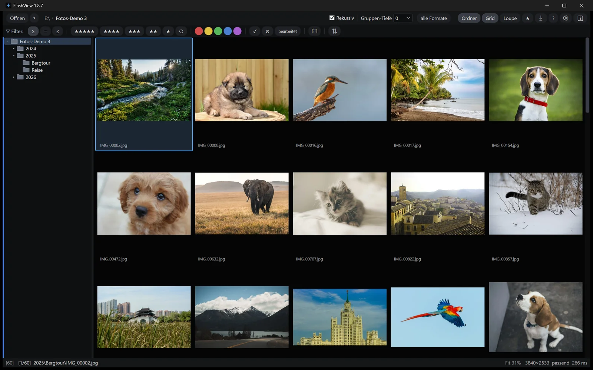
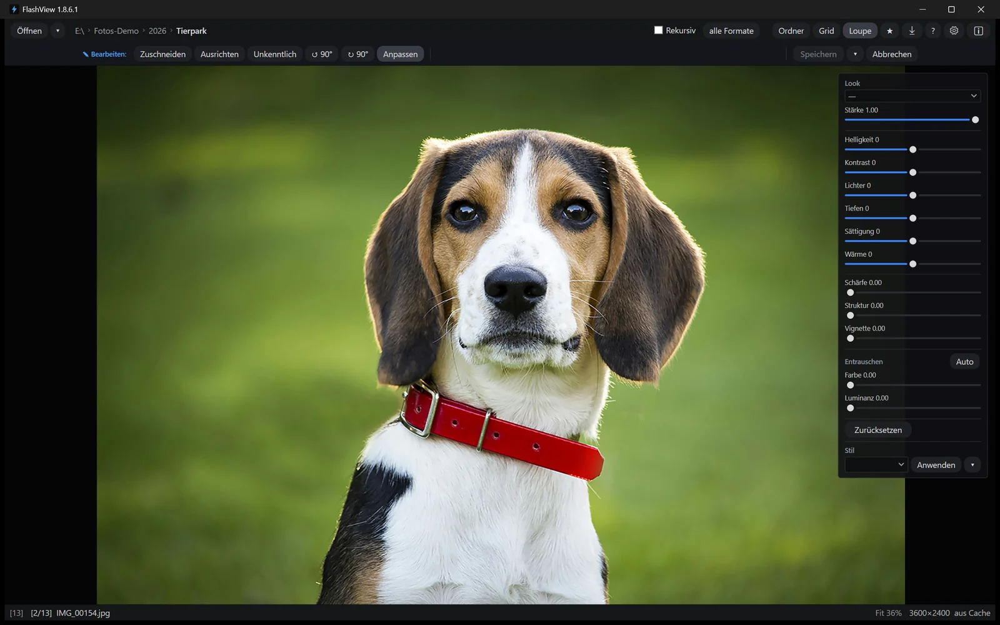

# FlashView

**Durch 100.000 Fotos blättern. Schneller als du denken kannst.**

Der schnelle Foto-Browser für Windows — und ein Culling-Werkzeug für genau eine
Aufgabe: durch einen Shoot kommen und die Keeper markieren, schneller als alles
andere auf dem Rechner.

> **Dieses Repository ist der Issue-Tracker von FlashView.** Fehlermeldungen und
> Feature-Wünsche gehören hierher — dafür ist es da. Das Programm selbst liegt auf
> **[flashview.net](https://flashview.net)**, der Quellcode ist nicht öffentlich.

[English](README.md) · Deutsch

## Was es tut

Einen Ordner mit Tausenden Fotos öffnen. Flüssig durchscrollen. Keeper mit einem
Tastendruck bewerten, Ausschuss markieren, auf das Wesentliche herunterfiltern — und
was übrig bleibt, exportieren oder gleich bearbeiten.

Sterne, Farbmarken und Flags werden als Standard-XMP geschrieben: in die JPEG selbst
oder in ein Sidecar neben die RAW-Datei. Jedes XMP-fähige Programm liest sie zurück,
ohne Import-Schritt und ohne Datenbank dazwischen.

## Was es besonders macht

**Gebaut für riesige Ordner.** Virtualisiertes Grid, Streaming-Thumbnails, kein
Vor-Indexieren — bleibt auch bei 100.000+ Bildern in einem einzelnen Ordner flüssig.

**Blitzschnell blättern.** Pfeiltasten, Mausrad, Scroll — jede Eingabe zeigt das
nächste Bild mit unter 50 ms Latenz, auch bei 45-Megapixel-JPEGs. Das ist das *Flash*
im Namen.

**Culling ist der Zweck, kein Nebenfeature.** Auto-Weiter springt in dem Moment, in
dem du bewertest — ein Shoot wird zu einem langen Lauf über die Zifferntasten. Der
Bildvergleich entscheidet eine Serie nebeneinander. Filter schneiden den Ordner live
mit. Zwischen Tastendruck und nächstem Bild steht nichts.

**Nativer Windows-Explorer-Workflow.** Rechtsklick auf ein Bild → *Öffnen mit
FlashView* → in unter einer Sekunde in der Loupe, mit dem ganzen Ordner bereits
geladen.

## Culling

- **Eine Taste pro Bild.** `0`–`5` für Sterne, `P` Pick, `X` Reject, `6`–`9` und `V`
  für die fünf Farbmarken. `U` löscht die Marken wieder.
- **Auto-Weiter.** `Feststelltaste` — und FlashView geht beim Bewerten sofort zum
  nächsten Bild. Bewerten, bewerten, bewerten; du fasst keine Pfeiltaste mehr an.
- **Eine Serie vergleichen.** `C` stellt Kandidat und Referenz nebeneinander, auf
  gleichem Zoom, und führt dich durch die Serie, bis das beste Bild übrig bleibt.
- **Hunderte auf einmal bewerten.** 200, 1.000 oder mehr auswählen, `3` drücken,
  fertig. `Strg+Z` nimmt den ganzen Batch zurück.
- **Live filtern.** Nach Sternen (mindestens / genau / höchstens), Farbmarke, Pick,
  Reject, Dateityp, Datum oder EXIF-Werten wie Kamera, Objektiv und ISO. Die Menge
  schrumpft dir unter den Händen, während du arbeitest.
- **Sortieren und gruppieren.** Name, Datum oder EXIF-Felder, auf- oder absteigend.
  Einen Elternordner nach Shoots gruppieren, mit einstellbarer Tiefe.
- **Bewertungsleiste und Status.** `R` zeigt, was am aktuellen Bild gesetzt ist; die
  Statusleiste führt mit, wie viele nach dem Filtern übrig sind.

## Ansehen

- **Grid und Loupe.** `G` und `L`, oder Doppelklick. Das Grid virtualisiert — ein
  Ordner mit 100.000 Bildern öffnet so schnell wie einer mit hundert.
- **Zoom und Details.** 1:1-Pixelansicht, an den Bildschirm anpassen, verschieben. Die
  Zoomstufe bleibt über Bilder hinweg stehen, getrennt für Quer und Hoch — Schärfe
  prüfen über Bild um Bild, ohne jedes Mal neu zu zoomen.
- **Histogramm.** `H` blendet RGB und Luminanz ein.
- **EXIF-Panel.** `I` zeigt Kamera, Objektiv, Brennweite, Blende, Verschlusszeit, ISO,
  Datum, Pixelgröße, Fotograf, Copyright.
- **Vollbild, Diashow, zweiter Monitor.** `F`, `S` und `F11` für eine große Loupe auf
  dem zweiten Bildschirm, während du auf dem Hauptschirm cullst.
- **Suchen.** `Strg+F` findet Ordner oder Bild per Name im ganzen Baum.

## Bearbeiten

> **Neu in 1.8.6, aktuell als Beta.**

FlashView bringt einen vollwertigen RAW-Entwickler mit. Ob du eine JPEG oder eine CR3
öffnest, ist dasselbe Panel mit denselben Reglern — was darunter passiert, entscheidet
die Datei.

- **Dein Original bleibt unangetastet.** Was du einstellst, liegt als kleines Rezept
  neben der Datei, dazu eine fertige JPEG. Du kannst eine Bearbeitung jederzeit wieder
  öffnen und weitermachen — gerechnet wird immer vom Original aus, es summiert sich
  nichts auf.
- **Regler.** Helligkeit, Kontrast, Lichter, Schatten, Sättigung, Wärme — bei RAW
  zusätzlich Tint, weil der Weißabgleich dort noch offen ist. Schärfen, Struktur,
  Vignette, Entrauschen.
- **Zuschneiden, ausrichten, schwärzen.** Dazu Drehen und Seitenverhältnis tauschen.
- **Looks.** Sechs mitgeliefert, darunter *Cinematic*, *Teal-Orange*, *Faded* und
  *Vivid*, jeder mit Stärke-Regler. Eigene `.cube`-LUTs in `%AppData%\FlashView\Luts`
  legen — sie stehen beim nächsten Start in der Liste.
- **Einen Stil über eine Serie ziehen.** Einstellungen von einem Bild kopieren und auf
  eine Auswahl von Hunderten einfügen.
- **An deinen Bildeditor und zurück.** FlashView rechnet deine Bearbeitung ein,
  schreibt eine PSD und startet den Editor, den es auf dem Rechner gefunden hat. Dort
  speichern — das Ergebnis taucht in FlashView von selbst auf. Kein Import, kein
  Nachdenken über Dateien.

## Dateien

- **Von der Karte importieren.** `Strg+I` kopiert in einen datierten Ordner und prüft
  das Kopierte nach.
- **Exportieren.** `Strg+E` schreibt frische JPEGs aus deiner Auswahl: Ziel,
  Benennung, lange Kante und Qualität auf einem Schirm.
- **Kopieren, verschieben, löschen.** `Strg+C` legt das Bild in die Zwischenablage,
  `Strg+Umschalt+C` seinen Pfad, `Entf` wandert in den Papierkorb.
- **Cloud-bewusst.** In Ordnern, die aus der Cloud synchronisieren, wählst du, was mit
  reinen Online-Dateien passiert: alle holen, ignorieren, oder nur die ersten N
  Vorschauen bei Bedarf — so öffnet ein riesiger Cloud-Ordner, ohne vorher alles
  herunterzuziehen.
- **Rekursiv und zuletzt geöffnet.** In einen Unterordner hineingehen oder einen
  ganzen Baum auf einmal nehmen; die letzten Ordner bleiben einen Klick entfernt.

## Tastatur

| | |
|---|---|
| `←` `→` | vorheriges / nächstes Bild |
| `0`–`5` | Sterne, `0` löscht |
| `P` `X` `U` | Pick, Reject, Marken löschen |
| `Feststelltaste` | Auto-Weiter beim Bewerten |
| `C` | Vergleichen |
| `G` `L` `F` | Grid, Loupe, Vollbild |
| `E` `H` `I` `R` | Bearbeiten, Histogramm, EXIF, Bewertungsleiste |
| `Strg+F` · `Strg+E` · `Strg+I` | Suchen · Exportieren · Importieren |
| `F1` | die vollständige Liste |

## Unterstützte Formate

**Bilder** — JPEG, PNG, TIFF, HEIF / HEIC, PSD.

**RAW, voll entwickelt** — Canon CR3 / CR2, Nikon NEF, Sony ARW, Fujifilm RAF,
Olympus / OM System ORF, Panasonic RW2, Pentax PEF, Samsung SRW, Hasselblad 3FR / FFF,
Adobe DNG. Die Auflösung spielt keine Rolle.

Die Einzelheiten stehen im [Handbuch](https://flashview.net/de/manual), samt der
Handvoll Bodys und Varianten, die sich anders verhalten.

## Systemvoraussetzungen

**Minimum** — läuft, aber nicht in „Flash"-Geschwindigkeit: Windows 10 21H2 oder 11,
x64, 4 Kerne, 8 GB RAM, SATA-SSD (HDDs werden nicht unterstützt). Erwarte 100–500 ms
Navigationslatenz, angenehm bis etwa 20.000 Bilder pro Ordner.

**Angenehm** — flüssig auch auf bescheidener Hardware, Intel-N-Mini-PCs eingeschlossen:
Windows 11, 4 Kerne, 16 GB RAM, SATA- oder NVMe-SSD. Unter 100 ms, angenehm bis rund
50.000 pro Ordner.

**Empfohlen** — für das Versprechen von unter 50 ms bei 100k-Ordnern: Windows 11, 8+
Kerne, 16 GB RAM, NVMe-SSD mit ≥ 1 GB/s sequenziellem Lesen.

Dunkles UI. Deutsch, Englisch und Russisch, nach deiner Systemsprache.

## Wo es sich einfügt

Die meisten Foto-Browser versprechen Geschwindigkeit. Die meisten funktionieren bei
ein paar hundert Bildern, geraten bei 10.000 ins Hintertreffen und geben bei 100.000
auf. FlashView ist genau für dieses obere Ende gebaut — für die Ordner, die
Fotografen tatsächlich ansammeln.

Und der Ordner ist nur die eine Hälfte. Culling ist ein Rhythmus: hinsehen,
entscheiden, weiter, ein paar tausend Mal. Jede Zehntelsekunde zwischen Tastendruck
und nächstem Bild wird einmal pro Bild bezahlt — deshalb ist das ganze Programm um
diese eine Zahl herum gebaut und nicht um eine Feature-Liste.

## Testen und kaufen

FlashView läuft nach der Installation **60 Tage in vollem Umfang** — kein Wasserzeichen,
keine gesperrten Funktionen, kein Konto. Danach braucht es einen Lizenzschlüssel:
einmalig gekauft, unbegrenzt gültig für diese Hauptversion.
[Kaufen](https://flashview.net/buy/?lang=de) ·
[Handbuch](https://flashview.net/de/manual)

Aktualisieren tut es sich selbst — ein Klick im Info-Fenster lädt die neue Version und
installiert sie.

## Mehr lesen

- [Hochzeits-Selektion](https://whitespace.de/de/artikel/hochzeit-culling-workflow/) ·
  [People & Portrait](https://whitespace.de/de/artikel/people-fotografie-workflow/) ·
  [Tier](https://whitespace.de/de/artikel/tier-fotografie-workflow/) ·
  [Sport](https://whitespace.de/de/artikel/sport-fotografie-workflow/) ·
  [Event](https://whitespace.de/de/artikel/event-culling-workflow/) ·
  [Konzert](https://whitespace.de/de/artikel/konzert-fotografie-workflow/)
- [Deine Kamera packt ein zweites Bild ins RAW. Hier ist, warum das alles verändert.](https://whitespace.de/de/artikel/raw-jpeg/)

[YouTube](https://www.youtube.com/@FlashViewVideo) ·
[Instagram](https://www.instagram.com/flashviewofficial/)

## Ökosystem

FlashView arbeitet Hand in Hand mit [StarRate](https://github.com/merlin1de/starrate)
— einem Nextcloud-Plugin für Gast- und Modellbewertungen. Der Workflow: shooten →
FlashView für den eigenen ersten Durchgang → nach Nextcloud hochladen → StarRate
sammelt externe Bewertungen → zurück in FlashView siehst du eigene und Gast-Bewertungen
konsolidiert, alles in Standard-XMP.

## Rückmeldung

Fehler oder Idee? **[Issue aufmachen](../../issues/new/choose).** Fehlermeldungen,
Workflow-Kritik und Screenshots sind alle willkommen — die Vorlagen fragen die
Handvoll Angaben ab, mit denen eine Meldung nachvollziehbar wird.

In diesem Repository liegt kein Code, Pull Requests können also nicht angenommen
werden. Alles andere — Lizenzen, Käufe, was weder Fehler noch Wunsch ist — läuft über
[flashview.net](https://flashview.net).

## Hintergrund

Entstanden aus meinem eigenen Canon-Workflow, 20D bis R6 Mk III. Ein Bild zu
entwickeln ist ein gelöstes Problem; der Schritt *davor* nicht. Sich durch 800 Bilder
zu klicken und die Keeper zu markieren, fühlte sich immer zäher an, als es müsste.
Diesen Schritt macht FlashView schnell.

Wenn dein Workflow ähnlich aussieht, wird er vielleicht auch schneller.

---

© Mathias Mischler · Whitespace Software. Bereitgestellt „wie besehen", ohne
Gewährleistung. Was FlashView speichert und was es nie sendet, steht in der
[Datenschutzerklärung](https://flashview.net/de/privacy).
