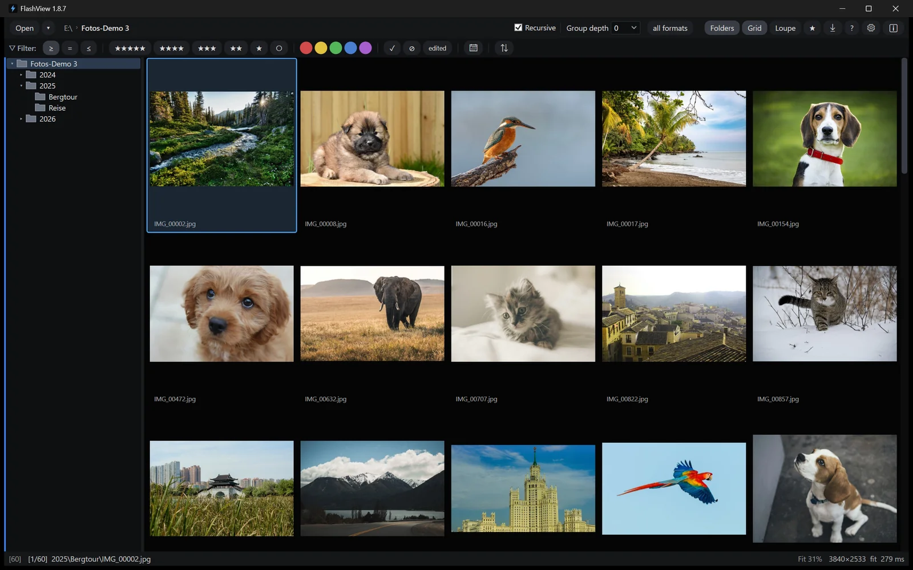
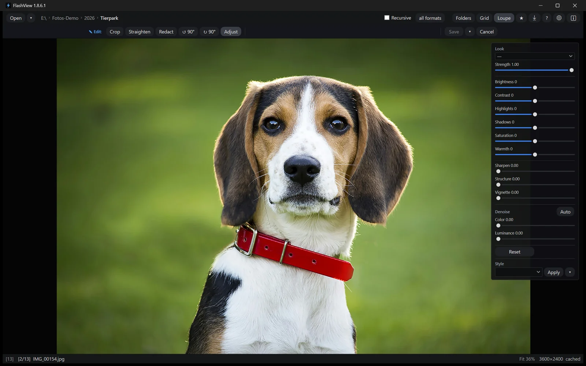

# FlashView

**Browse 100,000 photos. At the speed of thought.**

The fast photo browser for Windows — and a culling tool built for one job: getting
through a shoot and marking the keepers, faster than anything else on the machine.

> **This repository is the FlashView issue tracker.** Bug reports and feature ideas
> belong here — that's what it's for. The application itself lives at
> **[flashview.net](https://flashview.net)**; its source code is not hosted publicly.

English · [Deutsch](README.de.md)

## What it does

Open a folder with thousands of photos. Scroll through it at full speed. Rate your
keepers with a single keystroke, flag the rejects, filter down to what matters — then
export what's left or edit it on the spot.

Ratings, color labels and flags are written as standard XMP: into the JPEG itself, or
into a sidecar beside your raw file. Every XMP-aware program reads them back, with no
import step and no database in between.

## What sets it apart

**Built for massive folders.** Virtualized grid, streaming thumbnails, no
pre-indexing wait — stays responsive at 100,000+ images in a single folder.

**Browse at the speed of thought.** Cursor keys, mouse wheel, scroll — every input
shows the next image with sub-50 ms latency, even on 45-megapixel JPEGs. That's the
*Flash* in the name.

**Culling is the point, not a side feature.** Auto-advance moves on the instant you
rate, so a shoot becomes one long run of number keys. Compare mode settles a burst
side by side. Filters cut the folder down live, as you go. Nothing between the
keystroke and the next picture.

**Native Windows Explorer workflow.** Right-click any image → *Open with FlashView* →
you're in the loupe in under a second, with the entire folder already loaded.

## Culling

- **One key per picture.** `0`–`5` for stars, `P` pick, `X` reject, `6`–`9` and `V`
  for the five color labels. `U` clears the marks again.
- **Auto-advance.** `Caps Lock` and FlashView moves to the next image the moment you
  rate. Rate, rate, rate — you never touch an arrow key.
- **Compare a burst.** `C` puts candidate and reference side by side at matched zoom
  and walks you through the series until the best frame is left standing.
- **Batch-rate hundreds at once.** Select 200, 1,000 or more, press `3`, done. `Ctrl+Z`
  takes the whole batch back.
- **Filter live.** By rating (at least / exactly / at most), color label, pick, reject,
  file type, date, or EXIF values such as camera, lens and ISO. The set shrinks under
  your hands while you work.
- **Sort and group.** Name, date, or EXIF fields, ascending or descending. Group a
  parent folder by shoot, with configurable depth.
- **Rating bar and status.** `R` shows what's set on the current picture; the status
  bar keeps the count of what's left after filtering.

## Viewing

- **Grid and loupe.** `G` and `L`, or double-click. The grid virtualizes, so a folder
  of 100,000 opens as fast as one of a hundred.
- **Zoom and inspect.** 1:1 pixel view, fit-to-screen, pan. The zoom level sticks
  across images, separately for landscape and portrait — check focus on frame after
  frame without re-zooming.
- **Histogram.** `H` overlays RGB and luminance.
- **EXIF panel.** `I` shows camera, lens, focal length, aperture, shutter, ISO, date,
  pixel size, artist, copyright.
- **Fullscreen, slideshow, second monitor.** `F`, `S`, and `F11` for a full-size loupe
  on your second screen while you cull on the main one.
- **Search.** `Ctrl+F` finds a folder or an image by name across the whole tree.

## Editing

> **New in 1.8.6, currently in beta.**

FlashView carries a full raw developer. Whether you open a JPEG or a CR3, it's the
same panel and the same sliders — the file decides what happens underneath.

- **Your original is never touched.** What you set is stored as a small recipe beside
  the file, plus a finished JPEG. Reopen the edit any time and carry on — every
  calculation starts from the original, so nothing accumulates.
- **Sliders.** Brightness, contrast, highlights, shadows, saturation, warmth — plus
  tint on raw files, where the white balance is still open. Sharpen, structure,
  vignette, denoise.
- **Crop, straighten, redact.** Plus rotate and an aspect swap.
- **Looks.** Six bundled, among them *Cinematic*, *Teal-Orange*, *Faded* and *Vivid*,
  each with a strength slider. Drop your own `.cube` LUTs into
  `%AppData%\FlashView\Luts` and they show up in the list.
- **Carry a style across a series.** Copy the settings from one picture and paste them
  onto a selection of hundreds.
- **Hand it to your image editor and back.** FlashView bakes in your edit, writes a PSD
  and starts whichever editor it found on your machine. Save there and the result turns
  up in FlashView by itself — no import, no thinking about files.

## Files

- **Import from card.** `Ctrl+I` copies into a dated folder and verifies what it
  copied.
- **Export.** `Ctrl+E` writes fresh JPEGs from your selection: destination, naming,
  long-edge resize and quality on one screen.
- **Copy, move, delete.** `Ctrl+C` puts the image on the clipboard, `Ctrl+Shift+C` its
  path, `Delete` moves it to the recycle bin.
- **Cloud-aware.** In folders that sync from the cloud you choose what happens to
  online-only files: fetch all of them, ignore them, or pull just the first N previews
  on demand — so a huge cloud folder opens without dragging everything down first.
- **Recursive browsing and recent roots.** Drill into a subfolder or take a whole tree
  at once; your last folders stay one click away.

## Keyboard

| | |
|---|---|
| `←` `→` | previous / next image |
| `0`–`5` | stars, `0` clears |
| `P` `X` `U` | pick, reject, clear marks |
| `Caps Lock` | auto-advance while rating |
| `C` | compare |
| `G` `L` `F` | grid, loupe, fullscreen |
| `E` `H` `I` `R` | edit, histogram, EXIF, rating bar |
| `Ctrl+F` · `Ctrl+E` · `Ctrl+I` | search · export · import |
| `F1` | the full list |

## Supported formats

**Images** — JPEG, PNG, TIFF, HEIF / HEIC, PSD.

**Raw, fully developed** — Canon CR3 / CR2, Nikon NEF, Sony ARW, Fujifilm RAF,
Olympus / OM System ORF, Panasonic RW2, Pentax PEF, Samsung SRW, Hasselblad 3FR / FFF,
Adobe DNG. Resolution is not a factor.

The [manual](https://flashview.net/en/manual) has the details, including the handful of
bodies and variants that behave differently.

## System requirements

**Minimum** — works, but not "Flash" speed: Windows 10 21H2 or 11, x64, 4 cores,
8 GB RAM, SATA SSD (HDDs are not supported). Expect 100–500 ms navigation, comfortable
up to roughly 20,000 images per folder.

**Comfortable** — smooth on modest hardware, including Intel N-series mini PCs:
Windows 11, 4 cores, 16 GB RAM, SATA or NVMe SSD. Sub-100 ms navigation, comfortable
up to ~50,000 per folder.

**Recommended** — for the sub-50 ms, 100k-folder promise: Windows 11, 8+ cores,
16 GB RAM, NVMe SSD at ≥ 1 GB/s sequential read.

Dark UI. English, German and Russian, following your system language.

## Where it fits in

Most photo browsers promise speed. Most are fine at a few hundred images, fall behind
at 10,000, and give up at 100,000. FlashView is built for that high end — the folders
photographers actually accumulate.

And the folder is only half of it. Culling is a rhythm: look, decide, next, several
thousand times. Every tenth of a second between the keystroke and the next picture is
paid for once per frame — which is why the whole program is built around that one
number rather than around a feature list.

## Trying and buying

FlashView runs for **60 days in full** after installation — no watermark, no disabled
features, no account. After that it needs a license key: a one-off purchase, valid
indefinitely for that major version.
[Buy](https://flashview.net/buy/?lang=en) · [Manual](https://flashview.net/en/manual)

It updates itself, too — one click in the about window downloads and installs the new
version.

## Read more

- [Wedding culling](https://whitespace.de/en/artikel/hochzeit-culling-workflow/) ·
  [People & portrait](https://whitespace.de/en/artikel/people-fotografie-workflow/) ·
  [Wildlife](https://whitespace.de/en/artikel/tier-fotografie-workflow/) ·
  [Sport](https://whitespace.de/en/artikel/sport-fotografie-workflow/) ·
  [Event](https://whitespace.de/en/artikel/event-culling-workflow/) ·
  [Concert](https://whitespace.de/en/artikel/konzert-fotografie-workflow/)
- [Your camera packs a second image into the raw file. Here's why that changes everything.](https://whitespace.de/en/artikel/raw-jpeg/)

[YouTube](https://www.youtube.com/@FlashViewVideo) ·
[Instagram](https://www.instagram.com/flashviewofficial/)

## Ecosystem

FlashView works hand in hand with [StarRate](https://github.com/merlin1de/starrate) —
a Nextcloud plugin for guest and model ratings. The full workflow: shoot → FlashView
for your own first pass → upload to Nextcloud → StarRate collects external ratings →
back in FlashView you see your own and the guest ratings consolidated, all in standard
XMP.

## Feedback

Bug or feature idea? **[Open an issue](../../issues/new/choose).** Bug reports,
workflow critiques and screenshots are all welcome — the templates ask for the handful
of details that make a report reproducible.

This repository holds no code, so pull requests can't be accepted. Everything else —
licensing, purchases, anything that isn't a bug or a wish — goes through
[flashview.net](https://flashview.net).

## Background

Born out of my own Canon workflow, 20D through R6 Mk III. Developing a picture is a
solved problem; the step *before* it isn't. Clicking through 800 frames and marking the
keepers always felt slower than it had any right to be. FlashView makes that step fast.

If your workflow looks similar, it might speed yours up too.

---

© Mathias Mischler · Whitespace Software. Provided "as is", no warranty.
What FlashView stores and what it never sends is set out in the
[privacy statement](https://flashview.net/en/privacy).
